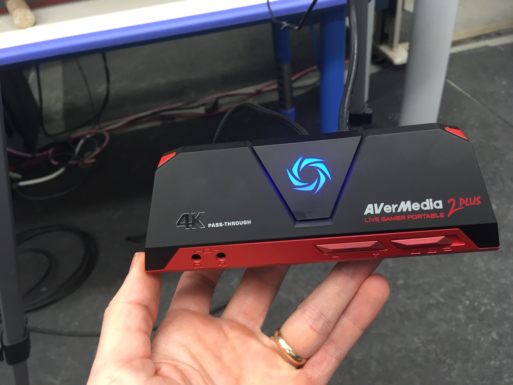

I made a ROS node that hooks up to a high quality video camera for automatically capturing my robotics experiments, using a bit of custom software and a piece of hardward called a [Capture Card](amzn.com/B0763TFZWT). This post will assume you know about [ROS](https://www.ros.org/). Code and documentation are available: https://github.com/UM-ARM-Lab/arm_video_recorder

When my robots are working smoothly I naturally want to take videos. I may run an experiment for 100 trials, and I want a video of each one. In addition to the "typical" run I want to showcase the best and worst, and also show any unexpected failure cases.

My robots often have a "head" camera, as well as perhaps an overhead and other video sources, all publishing on the ROS ecosystem. These streams are easy to save, combine, and automatically name with a timestamp, and there are some [great tools out there](https://github.com/ildoonet/ros-video-recorder). However, what I want, and what I created allows for:

1. High quality video (better than a webcam) 
2. Recording that starts automatically when my experiment starts
3. Programmatically named (e.g. `BTP_baseline_2020_04_12_15:22:15`)
4. Easy to set up on any computer with ROS(<5 minutes)
5. Reliable

My solution involves both hardware and software. The software is simple, just using openCV to connect to any camera plugged in over a USB port. You can then trigger a new recording via a ROS service, naming the file automatically. When running experiments my code starts the video capture before passing any commands to the robot. I name the file with any parameters special to that trial and slap on a time stamp.

## Capture Card

But how do we connect a high quality camera? As of this post I was unable to find a reasonable high quality webcam that I could just plug into a USB port.

Once again robotics can take advantage of the rise of gaming. Streamers use something called a Capture Card. This allows any video camera with an HDMI-out (your video camera probably has this) to connect to your computer via USB.

Now we can hook up any high quality camera with whatever fancy lenses we want. We can use ROS to programmatically start, stop, and name recordings. We can apply timestamps so we can sync up this video with any of our sensor data. If you already have ROS it is easy to set up.

