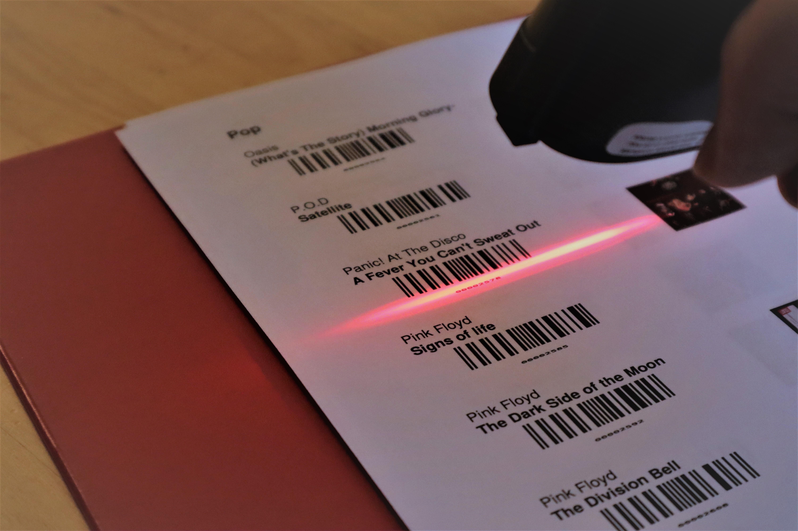
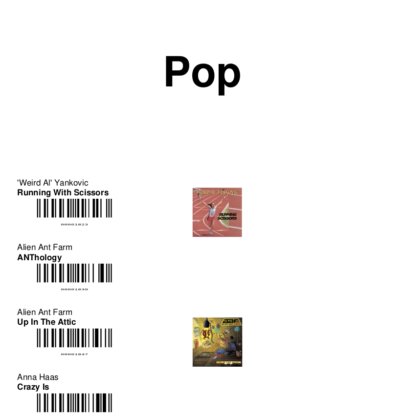
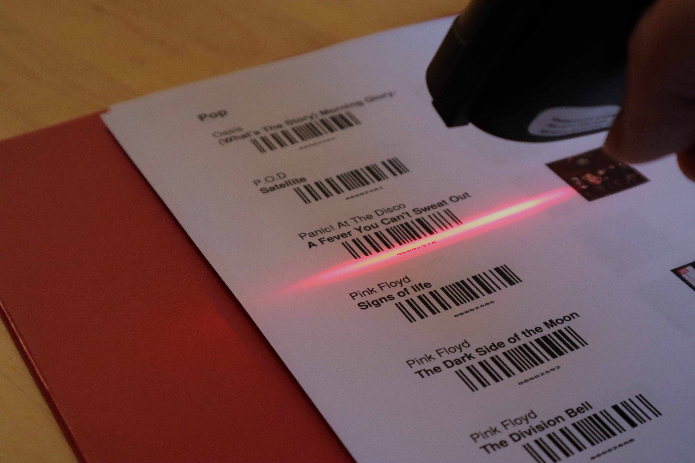

I built a raspberry pi music player that allows me to play any album I own by scanning a barcode from a binder. You can find code and instructions on [my github repo](https://github.com/bsaund/musicbox).

## Modern music players are missing some features from the past
In the era of records your music collection was an asset. You’d browse titles while over at a friend house, discovering new music and bonding with the collection’s owner. Playing a record involved a ritual of selection, cleaning, and gently positioning the needle.

CDs reduced this ritual but kept the browsing aspect while reducing the physical collection size. You could carry a decent collection in your car. CDs also kept the frustration of skipping over the best parts of a song due to a scratch.

Along came iTunes and the ability to fit “the library of congress” in your pocket. iTunes gift cards dominated the gift-for-a-casual-acquaintance market. Your music was kept organized, searchable, and playable with the push of a button. You still owned the albums, but it might take some work to get them out of the iTunes proprietary format. With such a convenient collection on a personal device, browsing another person’s music library declined. You’d just plug in your own iPod to play the song you knew.

Nowadays Spotify provides access to a still larger music library for a small monthly fee. At any time I can play any one of millions of songs. Why would you ever browse someone else’s spotify? Just have them send a link to a song. Why own music at all? Just participate in the endless scroll.

Personally I like owning my music. I want to reminisce by browsing my favorite albums from high school. I want to leaf through my music on a physical medium, not a tiny phone screen. I want a friend to be able to browse through my collection and offer compliments and critiques on my taste. I want to avoid the bulk and hassle of a CD collection.

My solution is a binder of albums, each with a barcode. Scanning a barcode plays the album on my bluetooth speaker. 

## The setup
I own many songs that are not on spotify. Some are CDs of specific performances of my favorite classical pieces. Some are CDs of niche bands. Some are personal performances. And some random mp3s that have meaning to me. I don't trust Spotify to be around in 15 years, and I like browsing my music physically, not on a computer screen.

I sorted my music by category (e.g. Classical, Pop,...), then by group, then optionally further by album, customizing my favorite playlists. I then generated a PDF of all this music. For each music folder I generate a barcode. Scanning the barcode sends a number to my raspberry pi which I capture in python. I look up the corresponding album and send a command to play the tracklist.

I built my setup around [mopidy](https://mopidy.com). Mopidy is a free python server that provides an HTTP interface for controlling music. You can play local files, spotify songs, podcasts, radio streams and more. With mopidy comes a few (bare-bones) websites from playing music, providing the searchability that a physical binder cannot.

## Future expansion
The binder full of barcodes is a convenient compact method of storing my hundreds of CDs worth of music, but it is not the prettiest. Fortunately it is easy to expand my setup using any input to the raspberry pi. I'm thinking of embedding RFID tags in nice wood carvings for my favorite albums. Placing these works of art over a hidden scanner will trigger the music is a classier manner than barcodes. Because my setup uses mopidy, these same sculptures could be used to trigger spotify playlists, radio streams, and podcasts too.

WIth a little linux and python knowledge, you can create this musicbox. Check out my [my github repo](https://github.com/bsaund/musicbox) for instructions.