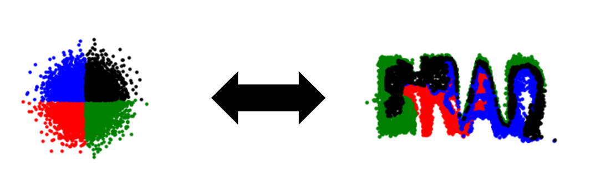
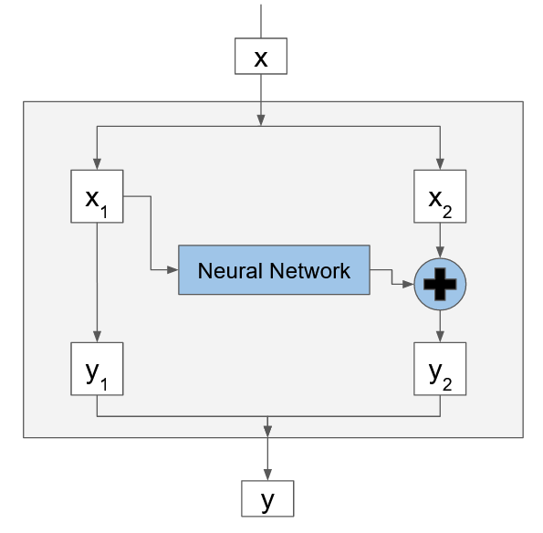
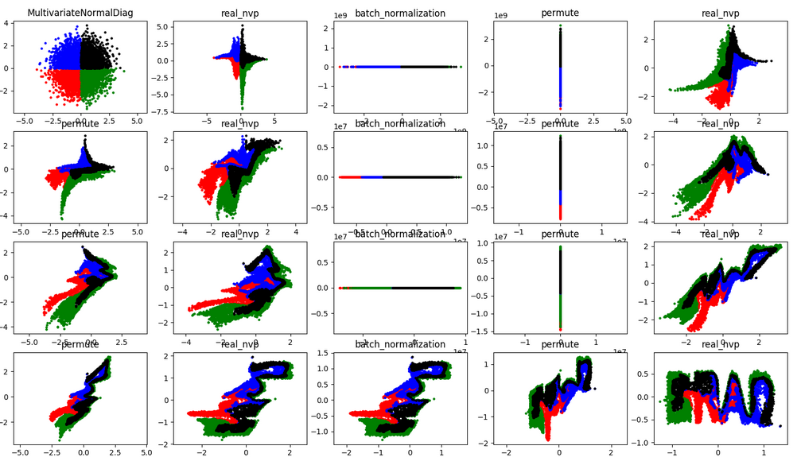

## My Foray into Normalizing Flows: 
This post and [accompanying code](https://github.com/bsaund/normalizing_flows) follow my introduction to Normalizing Flows, which have become popular in image compression and generation (e.g. [RealNVP](https://arxiv.org/abs/1410.8516), [NICE](https://arxiv.org/abs/1605.08803), and [glow](https://openai.com/blog/glow/)). My code is modeled after [Eric Jang's tutorial](https://blog.evjang.com/2018/01/nf2.html ), but written in tensorflow 2.

## What is a normalizing flow?
A normalizing flow is a sequence of invertible transformations mapping one (simple) probability distribution onto another (complicated) probability distribution. For example consider the simple distribution of an image where every pixel is independently sampled from a gaussian. This will look like static. The right normalizing flow can map this static into a natural image. We could then sample a static image and use the normalizing flow to generate a random natural image.

In this post we will be doing something much simpler: we will just be mapping 2D points with <x,y> coordinates sampled from a gaussian onto 2D points sampled from a picture of our choosing (in this case, my name). Most of the machinery is the same, but we do not need copious time and expensive computers to train this model. The code is available and written in tensorflow 2.0 (https://github.com/bsaund/normalizing_flows).

To me, a few things initially seem weird about normalizing flows.

1. How do you make a neural network invertible? The common machinery (Dense layers, convolutions, and relu activations) are not invertible.
2. The "latent" space is the same size as the "image" space. This is unlike the typical "hour-glass" shaped  autoencoder.

## Normalizing flows are invertible. How do you make a neural net invertible? 
This is a clever mathematical trick. Each layer of the flow has its own network. Let's look at a  single layer, with network $f$. We are not going to try to invert $f$. Instead, we are going to split the input to the layer into two pieces $x_1$ and $x_2$ and compute the output in two parts $y_1$ and $y_2$.

$$y_1 = x_1$$
$$y_2 = x_2 + f(x_1)$$

Because of our clever split we can invert this transformation without ever inverting the neural network $f$

$$x_1=y_1$$
$$x_2=y_2-f(y_1)$$

I want to dwell on this for one moment because I think this is very clever. We make an invertible function (the flow) using a non-invertible function (a neural network). The trick is that we have access to the input of $f$ on either side of the layer (since $x_1 = y_1$). 

Notice though that half of x (namely $x_1$) was not changed at all in this layer. To make sure each element has a chance to go through a neural network, we stack many of these layers on top of each other, permuting the data in between. By adding $x_2$ to $f(x_1)$ we make sure the two halfs of the partition mix. Finally, there are move advanced ways of mixing the output than just $y_2 = x_2 + f(x_1)$.

## The mapped space is the same size as the input space?
Since the transformation is invertible, the input space must be the same size as the output space. This at first seems odd, since other techniques such as auto-encoders are focused on representing things such as natural images in a (usually) much smaller latent space. 

And if we haven't changed the size of the image representation, what have we really gained? The answer is simplicity. In a natural image, each pixel value is not independent. If pixel (30, 24) is yellow, then pixel (30, 25) is also probably yellow, though not necessarily. How likely is pixel (55, 73) to be blue? Well, what is the whole scene about? Are there any blue flowers in other parts of the image? It is very hard to describe these conditional distributions (though many methods try to model this!). 

Instead, in normalizing flows we use a very simple base distribution, such as a multi-dimensional gaussian, but where each pixel is independent of every other pixel. Of course sampling from this gives static. Yet using the right flow, we can transform these pixels that were independent into a complex image, with all the dependencies of natural images.

## Putting it all together:

In the repository we follow the same architecture as the the [previous tutorial](https://blog.evjang.com/2018/01/nf2.html) and stack 8 realnvp layers, inserting 4 batch normalization layers. You can look up the details of these layers, but all have this bijector property that allows us to invert the transform as described above. After training we sample 8000 points from a normal distribution (upper left) and color them based on quadrant. We follow these points through the layers watching them warp.

We can visually observe some of the properties of the flow. You'll notice in every `real_nvp` layer only the `y` (verticle) coordinate changes. While with my coloring you can't tell how each individual point is transformed, you can see that that the distribution of `x` values remaing the same after each real`nvp` layer. You can also see that `permute` layer mirrors the data about the line `y=x`.

## A few comments:
Even with this relatively simple example I found the training is not always stable. Initially the loss decreases rapidly, but sometimes the training fails with a loss of `nan`. Decreasing the learning helps (unsurprisingly). Batch normalization layers are also suppose to help, but in my experience produce these odd effects, flattening the data in one dimension. 

## Other resources:
This post closely mirrors Eric Jang's tutorial, which goes into more depth than I have here. I have copied his example, but written my code in tensorflow 2.  https://blog.evjang.com/2018/01/nf2.html 

The original papers are also fairly accessible:
https://arxiv.org/abs/1605.08803
https://arxiv.org/abs/1410.8516
